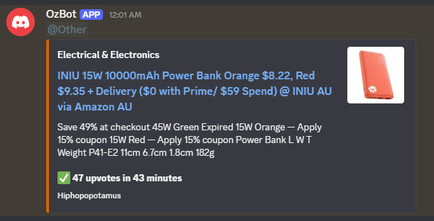

# OzBargain Scraper Discord Bot 

A discord bot that sends trending deals from OzBargain to a discord server to notify people 

## Features so far 

- Scrapes deals from new deals section in OzBargain 
- Sends deals as an embed to a discord server channel 
- Filter deals by upvotes, time since post (eg. x upvotes in y mintues), categories and keywords 
- Can choose a role to ping in that specific channel to notify users 
- Multiple types of deals can be monitored per channel 

## Example Commands 

### `/start`

Starts monitoring OzBargain deals in that specific channel 

You can optionally add filters:

| Option | Description |
|------|------|
| `upvotes` | Min upvotes required (default 20 upvotes) |
| `time` | Time since post (default 60 minutes) | 
| `category` | Filter deals by category |
| `keywords` | Filter deals containing specific keywords in title |
| `role` | Role to notify users when deal is posted | 

```
/start upvotes:20 time:60 category:Computing keywords:GPU role:@PC
```

Sends deals in the computing category with GPU in the title if the post has 20 upvotes in the first 60 minutes of post (and will ping users with @PC role)

### `/stop`

```
/stop
```

Will stop scraping deals in that specific channel 

## Photo of bot sending a deal 



## Project Setup

### 1. Install dependencies 

```bash
npm install
```

### 2. Create .env file 

Create a `.env` file in the root of the project and add the following 

```
TOKEN = discord_bot_token
GUILD_ID = discord_server_id
CLIENT_ID = discord_client_id
```

### 3. Register commands 

Run the following to register commands in server

```bash
node src/register-commands.js
```

You should now be able to see the commands for the bot in your server 

### 4. Start the bot 

```bash
node src/index.js
```
